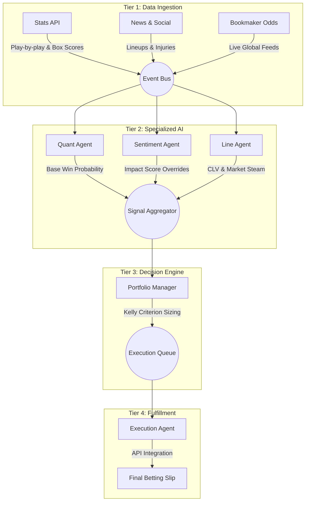

# CourtSideEdge: Real-Time Quantitative Analytics & Wager Terminal

CourtSideEdge is an agentic sports-betting system built for real-time edge detection, portfolio risk sizing, and qualitative event parsing. It orchestrates a streamlined **4-Tier Agentic Architecture** communicating via SSE streams, backing up to SQLite, and exposing live data via a premium dark-mode dashboard.

---

## 1. 4-Tier Agentic Architecture

The system features a clean, deterministic 4-tier pipeline that processes data sequentially into executable betting slips.



### The Agent Roster

| Tier | Agent | Role | Description |
|------|-------|------|-------------|
| 1 | **Stats API** | Data Ingestion | Syncs historical team stats, rosters, and past outcomes. |
| 1 | **News & Social** | Data Ingestion | Listens to beat reporters on X/Twitter for breaking updates. |
| 1 | **Bookmaker Odds** | Data Ingestion | Monitors sportsbooks for live line openings & movements. |
| 2 | **Quant Agent** | Specialized AI | 6-layer ensemble projecting true probabilities. |
| 2 | **Sentiment Agent** | Specialized AI | LangChain parser using GPT-4o-mini to extract injury impact scores. |
| 2 | **Line Agent** | Specialized AI | Tracks market steam and Closing Line Value (CLV). |
| 3 | **Portfolio Manager** | Decision Engine | Aggregates edge and applies Fractional Kelly Criterion bankroll sizing. |
| 4 | **Execution Agent** | Fulfillment | Enforces circuit breakers and generates the final Kelly-sized betting slip. |

---

## 2. Core Modules

### 2.1 Agentic Portfolio Manager (Kelly Criterion)
The Tier 3 Decision Engine calculates the exact percentage of the bankroll to wager using the Kelly Criterion. It takes the baseline probability generated by the **Quant Agent** and penalizes it based on the **Sentiment Agent's** structured LLM output (e.g., subtracting 15% probability if a minutes restriction is detected).

### 2.2 LLM News Parsing (LangChain + Pydantic)
The Tier 2 Sentiment Agent uses `langchain-openai` to parse unstructured tweets into a strict `PlayerStatus` schema. 
- Automatically identifies the player, status (OUT, QUESTIONABLE, etc.), and generates a float `impact_score`.

### 2.3 Edge Dashboard
A modern, dark-mode Bloomberg-style terminal built in React.
- **Real-Time Streaming**: Agents stream their "chain of thought" to the frontend via Server-Sent Events (SSE).
- **Audit Trail**: Users can watch the Quant, Sentiment, Line, and Portfolio agents debate the edge live.
- **Kelly Slips**: Generates visual bet slips displaying EV%, true probability, and wager amounts.

---

## 3. Developer Setup & Environment Instructions

### Prerequisites
- **Node.js** (v18+)
- **Python** (v3.11+)

### Local Development Flow

1. **Clone & Configure Environment**:
   Create a `.env` file at the root to supply necessary keys:
   ```env
   OPENAI_API_KEY=sk-...
   PORT=3000
   ```

2. **Database Seeding**:
   The backend uses SQLite with Drizzle ORM.
   ```bash
   cd web/server
   npm run seed
   ```

3. **Run Server & Client locally**:
   - **Backend Server (Port 3000)**:
     ```bash
     cd web/server
     npm install
     npm run dev
     ```
   - **Frontend Dashboard (Port 5173)**:
     ```bash
     cd web/client
     npm install
     npm run dev
     ```

## 4. API Reference

- `GET /api/analyze-prop`: SSE streaming endpoint simulating the 4-tier pipeline decision loop.
- `GET /api/agents/health`: Exposes the dynamic health status of the 4-tier agent ecosystem.
