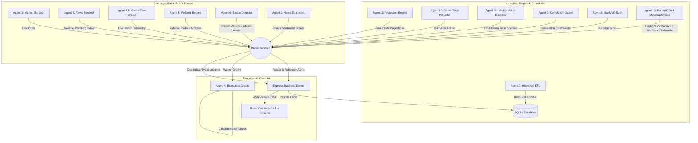

# CourtSideEdge: Real-Time WNBA Quantitative Analytics & Wager Terminal

CourtSideEdge is an agentic quantitative sports-betting system built for real-time edge detection, portfolio risk sizers, referee telemetry analysis, and high-EV parlay formulation. It orchestrates a 13-agent decoupled microservice architecture communicating via Redis Pub/Sub, backing up to SQLite, and exposing live data via WebSockets and SSE to a premium dashboard.

---

## 1. System Architecture

The following diagram maps the decoupled agent grid, the Redis messaging bus, the SQLite database layer, and the React client dashboard:



### The 13-Agent Roster

1. **Agent 0: Historical ETL**: Asynchronously synchronizes team stats, historical rosters, and past outcomes from sports APIs to SQLite.
2. **Agent 1: Market Scraper**: Continuously monitors sportsbooks for live line openings, movements, and spreads.
3. **Agent 2: News Sentinel**: Listens to social media feeds (Twitter/X API) and WNBA beat reporters for breaking team updates.
4. **Agent 2.5: Game Flow Oracle**: Aggregates real-time play-by-play flow data to compute mid-game probability shifts.
5. **Agent 3: Projection Engine**: Runs an ensemble mathematical engine to project individual player props.
6. **Agent 4: Execution Oracle**: Listens to validated wager recommendations, enforces a strict `15%` max drawdown circuit breaker, and handles transaction logs.
7. **Agent 5: Referee Engine**: Profiles WNBA officiating crews to gauge pace effects and foul rate thresholds.
8. **Agent 6: Steam Detector**: Analyzes high-volume market moves to spot syndicate action and sharp liquidity.
9. **Agent 7: Correlation Guard**: Monitors same-game parlays for overlapping variables and negative covariance.
10. **Agent 8: Bankroll Sizer**: Calculates optimal Kelly Criterion stakes based on projected book edges.
11. **Agent 9: News Sentiment**: Runs NLP sentiment scoring on coach quotes and travel fatigue reports.
12. **Agent 10: Game Total Projector**: Evaluates tempo and defensive ratings to project full-game over/under bounds.
13. **Agent 11: Market Value Detector**: Scans external books to highlight pricing discrepancies and edge percentages.
14. **Agent 13: Matchup Oracle / Parlay Gen**: FAST API microservice that queries active positive-EV projections and synthesizes a 2-leg parlay with a qualitative matchup summary.

---

## 2. Developer Setup & Environment Instructions

### Prerequisites
- **Node.js** (v18+)
- **Python** (v3.11+)
- **Docker** & **Docker Compose** (Required for containerized runtime)

### Local Development Flow

1. **Clone & Configure Environment**:
   Create a `.env` file at the root:
   ```env
   REDIS_URL=redis://localhost:6379
   PORT=3000
   ```

2. **Database Seeding**:
   The database schema is initialized and populated automatically when the backend server launches. To reset the DB manually:
   ```bash
   cd web/server
   npm run seed
   ```

3. **Launch the Redis Bus & Agents (Docker)**:
   ```bash
   docker-compose up --build -d
   ```
   *Note: If Docker is unavailable locally, the express backend handles connection failures gracefully and defaults to offline/SQLite-direct capabilities.*

4. **Run Server & Client locally**:
   - **Backend Server (Port 3000)**:
     ```bash
     cd web/server
     npm install
     npm run dev
     ```
   - **Frontend Dashboard (Port 5173)**:
     ```bash
     cd web/client
     npm install
     npm run dev
     ```

---

## 3. Telemetry Systems & Messaging Bus

CourtSideEdge relies on Redis as a lightweight message broker, propagating events across nodes asynchronously:

### Pub/Sub Channel Registry
- `channel_live_odds`: Broadcasts raw sportsbook odds updates.
- `channel_true_projections`: Fired by Agent 3 when new player projections are completed.
- `channel_ev_alerts`: Emitted by Agent 11 when book price differences exceed historical boundaries.
- `channel_roster_updates` / `channel_referee_context` / `channel_sentiment_context`: Event streams for qualitative variables. The Express bridge intercepts these feeds and stores them permanently into SQLite.
- `channel_execution_queue`: Sent to Agent 4 to initiate wager logging.

### Web Telemetry Bridging
- **WebSockets (`ws://localhost:3000`)**: Establishes a persistent real-time channel to update odds matrices and health telemetry inside the client UI.
- **Server-Sent Events (SSE) (`/api/stream/alerts`)**: Supplies a continuous stream of EV alerts, roster shifts, and qualitative warnings.

---

## 4. SQLite Data Schema

All persistent configurations, historical wagers, bankroll snapshots, and qualitative events are saved to `hoopstats_wnba.db`.

```sql
-- Core Players Registry
CREATE TABLE players (
    id TEXT PRIMARY KEY,
    name TEXT NOT NULL,
    team TEXT NOT NULL,
    status TEXT -- 'ACTIVE', 'INJURED'
);

-- Bankroll Tracking for drawdown metrics
CREATE TABLE bankroll_history (
    id INTEGER PRIMARY KEY AUTOINCREMENT,
    timestamp INTEGER NOT NULL,
    balance REAL NOT NULL,
    drawdown_pct REAL NOT NULL
);

-- Wager Ledger supporting parlay containers and child legs
CREATE TABLE bets (
    id INTEGER PRIMARY KEY AUTOINCREMENT,
    parent_id INTEGER, -- Points to parent id if this row is a parlay leg
    is_parlay INTEGER, -- 1 if this is a parlay container, 0/null otherwise
    player TEXT,
    stat TEXT,
    line REAL,
    over_under TEXT,
    book_odds INTEGER NOT NULL,
    true_odds REAL,
    edge_pct REAL,
    stake REAL NOT NULL,
    result TEXT, -- 'WIN', 'LOSS', 'PUSH', NULL (pending)
    actual_value REAL,
    profit_loss REAL,
    placed_at INTEGER NOT NULL,
    settled_at INTEGER,
    opposing_team TEXT,
    notes TEXT
);

-- Qualitative Event Logs (Tweet sentiments, Referee alerts)
CREATE TABLE qualitative_events (
    id INTEGER PRIMARY KEY AUTOINCREMENT,
    channel TEXT NOT NULL,
    payload TEXT NOT NULL,
    timestamp INTEGER NOT NULL
);
```
