# CourtSideEdge: Real-Time WNBA Quantitative Analytics & Wager Terminal

CourtSideEdge is an agentic sports-betting system built for real-time edge detection, portfolio risk sizers, referee telemetry analysis, and high-EV parlay formulation. It orchestrates a **21-agent decoupled microservice architecture** communicating via Redis Pub/Sub and Redis Streams, persisting to PostgreSQL (or SQLite for single-host setups), and exposing live data via WebSockets and SSE to a premium dashboard.

---

## 1. System Architecture

```mermaid
graph TD
    %% Scrapers & Ingestion Agents
    subgraph Data Ingestion [Data Ingestion & Event Stream]
        A1[Agent 1: Market Scraper] -->|Live Odds| Redis((Redis Pub/Sub))
        A1 -->|Raw Line Updates| A17[Agent 17: Velocity Agent]
        A17 -->|Velocity / Steam Alerts| Redis
        A2[Agent 2: News Sentinel] -->|Tweets / Breaking News| Redis
        A25[Agent 2.5: Game Flow Oracle] -->|Live Match Telemetry| Redis
        A5[Agent 5: Referee Engine] -->|Referee Profiles & Styles| Redis
        A5 -->|Write Enrichments| CTX[(Context Store)]
        A6[Agent 6: Steam Detector] -->|Market Volume / Steam Alerts| Redis
        A9[Agent 9: News Sentiment] -->|Coach Sentiment Scores| Redis
        A9 -->|Write Enrichments| CTX
    end

    %% Shared Memory Layer
    subgraph Memory Layer [Shared Agent Memory]
        CTX -->|Read Context & Calibration| A3
        A15[Agent 15: Drift Monitor] -->|Write Calibration| CTX
    end

    %% Analytical & Math Core
    subgraph Core Analytics [Analytical Engine & Guardrails]
        A0[Agent 0: Historical ETL] -->|Historical Context| DB[(SQLite Database)]
        A3[Agent 3: Projection Engine] -->|True Odds Projections| Redis
        A10[Agent 10: Game Total Projector] -->|Game O/U Lines| Redis
        A11[Agent 11: Market Value Detector] -->|Confidence-Scored Divergence| Streams((Redis Streams))
        A7[Agent 7: Correlation Guard] -->|Correlation Coefficients| Streams
        A8[Agent 8: Bankroll Sizer] -->|Dynamic Kelly Sizing| Streams
        A13[Agent 13: Parlay Gen & Matchup Oracle] -->|FastAPI EV Parlays + Hermes Rationale| Redis
    end

    %% Decision Pipeline (Redis Streams with DLQ)
    subgraph Decision Pipeline [Critical Decision Pipeline]
        Streams -->|stream_market_intelligence| A7
        A7 -->|stream_approved_edges| A8
        A8 -->|stream_execution_queue| A4[Agent 4: Execution Oracle]
        A4 -->|Confidence Gate + Circuit Breaker| A4
        Streams -.->|Failed Messages| DLQ[Dead Letter Queue]
    end

    %% Audit & Tracking
    subgraph Audit & Tracking [Traceability & Calibration Layer]
        A11 -->|Log Decision| AUDIT[(Decision Audit Trail)]
        A7 -->|Log Decision| AUDIT
        A8 -->|Log Decision| AUDIT
        A4 -->|Log Decision| AUDIT
        A14[Agent 14: CLV Tracker] -->|Closing Line Value| DB
        DB -->|Query Settled Bets| A15
        DB -->|Query Active Bets| A16[Agent 16: Hedge Oracle]
        A16 -->|Write Hedging Alerts| DB
    end

    %% Execution & Telemetry
    subgraph Execution & Telemetry [Execution & Client UI]
        Redis -->|Roster & Rationale Alerts| Backend[Express Backend Server]
        Backend -->|Drizzle ORM| DB
        Backend -->|WebSockets / SSE| UI[React Dashboard / Bet Terminal]
    end

    %% Event Logging
    Redis -->|Qualitative Event Logging| Backend
```



### The 21-Agent Roster

| # | Agent | Role | Channel/Stream | Protocol |
|---|-------|------|----------------|----------|
| 0 | **Historical ETL** | Syncs team stats, rosters, past outcomes to SQLite | Direct DB | Batch |
| 1 | **Market Scraper** | Monitors sportsbooks for live line openings & movements | `channel_live_odds` | Pub/Sub |
| 2 | **News Sentinel** | Listens to Twitter/X for breaking team updates | `channel_roster_updates` | Pub/Sub |
| 2.5 | **Game Flow Oracle** | Aggregates real-time play-by-play for mid-game shifts | `channel_live_flow` | Pub/Sub |
| 3 | **Projection Engine** | 6-layer ensemble (Bayesian + Poisson + Copula + XGBoost). **Reads shared context store** for referee/fatigue/roster enrichments | `channel_true_projections` | Pub/Sub |
| 4 | **Execution Oracle** | Enforces 15% max drawdown circuit breaker + **0.5 confidence gate** | `stream_execution_queue` | **Streams** |
| 5 | **Referee Engine** | Profiles officiating crews for pace/foul effects. **Writes to context store** | `channel_referee_context` | Pub/Sub + Context |
| 6 | **Steam Detector** | Spots syndicate action and sharp liquidity moves | `channel_steam_alerts` | Pub/Sub |
| 7 | **Correlation Guard** | Monitors same-game exposure with **dynamic limits** (3-4 based on confidence) | `stream_market_intelligence` → `stream_approved_edges` | **Streams** |
| 8 | **Bankroll Sizer** | **Dynamic Kelly** with adaptive fractions (HOT/NORMAL/COLD/HALT regimes) | `stream_approved_edges` → `stream_execution_queue` | **Streams** |
| 9 | **News Sentiment** | NLP sentiment on coach quotes and travel fatigue. **Writes to context store** | `channel_sentiment_context` | Pub/Sub + Context |
| 10 | **Game Total Projector** | Evaluates tempo/defense for full-game O/U bounds | `channel_game_totals` | Pub/Sub |
| 11 | **Market Value Detector** | Scans book pricing discrepancies with **confidence scoring** | `stream_market_intelligence` | **Streams** |
| 13 | **Parlay Gen & Matchup Oracle** | FastAPI service generating 2-leg EV parlays with qualitative summaries | `/api/parlay/generate` | REST |
| 14 | **CLV Tracker** | Measures Closing-Line Value — the gold standard for betting sharpness | `channel_live_odds` + `/api/clv/*` | Pub/Sub + REST |
| 15 | **Drift Monitor** | Calculates rolling projection error (MAE/bias) and writes offset context | `/api/drift/status` | REST + Context |
| 16 | **Hedge Oracle** | Computes locked-in EV hedging and arbitrage middle actions | `/api/hedges` | REST + SQL |
| 17 | **Velocity Agent** | Monitors rate-of-change velocity anomalies in lines/odds | `channel_live_odds` | Pub/Sub |
| 18 | **Liquidity Oracle** | Monitors and exposes max bet limits per sportsbook to prevent limit rejections | `/api/liquidity/limits` | REST |
| 19 | **Sharp Profiler** | Tracks Pinnacle/Circa lines as leading indicator of retail lag bets | `/api/sharp/consensus` | REST + Pub/Sub |
| 20 | **Hedge Executor** | Places automated counter-hedges in SQLite database for EV locks | `/api/hedges` | REST + SQL |
| 21 | **Rotation Tracker** | Tracks fouls and live minutes adjustments to adjust projections | `/api/live/rotations` | REST + Context |

---

## 2. Architecture Improvements (v5.0)

### Shared Agent Memory Layer
Agents no longer operate in isolation. A `agent_context_store` table and Redis hash (`agent:context:{game_id}`) act as a shared blackboard:
- **Agent 5** writes referee foul bias profiles
- **Agent 9** writes coach fatigue and sentiment scores
- **Agent 3** reads all enrichments before running its ensemble, adjusting usage redistribution and pace projections

### Confidence Scoring Protocol
Every signal on Redis now carries a standardized confidence envelope (`confidence`, `sample_size`, `decay_seconds`). This allows:
- Agent 7 to use dynamic correlation limits (allow 4 same-game bets if all signals are >0.85)
- Agent 8 to scale Kelly fraction by signal confidence
- Agent 4 to reject execution below a 0.5 confidence floor

### Decision Audit Trail
A `decision_audit` table logs every agent's approve/reject/size/execute decision with a shared `trace_id` UUID. Query any trace to see the full decision chain: Agent 11 → 7 → 8 → 4.

### Redis Streams & Dead-Letter Queue
The critical execution pipeline (`stream_market_intelligence` → `stream_approved_edges` → `stream_execution_queue`) uses Redis Streams with consumer groups instead of fire-and-forget Pub/Sub. Failed messages move to `*_dlq` streams for retry.

### Dynamic Kelly Recalibration
Agent 8 queries the last 50 settled bets from SQLite to compute realized win rate, then adapts:
- Win rate ≥ 60% → 1/3 Kelly (HOT_STREAK)
- Win rate ≥ 50% → 1/4 Kelly (NORMAL)
- Win rate ≥ 48% → 1/6 Kelly (COLD_STREAK)
- Win rate < 48% → **HALT all sizing**

### Closing-Line Value (CLV) Tracker
Agent 14 records the closing odds at game time and calculates CLV percentage for every bet. The `/api/clv/summary` endpoint provides aggregate CLV statistics broken down by stat category and result type.

---

## 2.1 Architecture Improvements (v5.1)

### Projection Drift & Calibration (Agent 15)
Agent 15 monitors settled bet outcomes from the SQLite ledger to compute Mean Absolute Error (MAE) and bias. It saves calibration multipliers into the context store, which Agent 3 reads to dynamically shift points, assists, and rebounds projections.

### Dynamic Hedging & Arbitrage (Agent 16)
Agent 16 scans active bets against live lines to detect middle and lock-in profit hedging windows. Recommendations are saved to the `hedging_opportunities` table and surfaced on the diagnostics dashboard.

### Line Movement Velocity (Agent 17)
Agent 17 calculates odds/line velocity delta per minute. Real-time anomalies are pushed to `channel_steam_alerts` and rendered on the market divergence feed.

---

## 2.2 Architecture Improvements (v5.2)

### Sportsbook Limits & Liquidity Tracking (Agent 18)
Agent 18 monitors sportsbook limits (e.g. Pinnacle, FanDuel, DraftKings) and registers active bet limits. The Bankroll Sizer (Agent 8) fetches these limits to scale stake sizes accordingly, preventing wager rejection.

### Sharp Consensus Profiler (Agent 19)
Agent 19 tracks line changes on sharp books (Pinnacle/Circa) and publishes consensus triggers. Agent 11 subscribes to these moves to immediately identify and execute retail sportsbook lag wagers.

### Automated Hedge Executions (Agent 20)
Agent 20 integrates with Agent 16's Hedging Oracle to automatically execute offsetting bets in the SQLite ledger when locked-in EV thresholds are crossed. All automated hedges are logged in the `bets` ledger with `is_hedge = 1`.

### Live Rotations & Fouls Tracker (Agent 21)
Agent 21 tracks game flow fouls and rotation changes. It publishes minutes adjustments directly to the shared context store, which Agent 3 reads to apply immediate projection reductions.

---

## 2.3 Architecture Improvements (v5.3)

### Database: PostgreSQL or SQLite
Set `DATABASE_URL=postgresql://...` (see `.env.example`) and both the Express server and every Python agent switch from the SQLite file to PostgreSQL — one network endpoint shared by all tiers. This removes the single-host constraint on the ledger-coupled agents (the remote agent tier reads/writes the ledger directly instead of going through the HTTP audit fallback and Redis bankroll mirrors), and a wrong connection string fails loudly at startup instead of silently writing to a stray file. The bundled `postgres` compose service starts with `COMPOSE_PROFILES=postgres`; copy an existing ledger over with `deploy/scripts/migrate_sqlite_to_postgres.py`.

Without `DATABASE_URL`, SQLite remains fully supported: **WAL (Write-Ahead Logging) mode** with a 5-second `busy_timeout` eliminates `SQLITE_BUSY` errors from concurrent agent writes, and foreign key enforcement is enabled.

### Docker Healthchecks & Service Dependencies
All containers now include `healthcheck` definitions. Redis uses `redis-cli ping` and the web server uses an HTTP `/health` endpoint. `depends_on` entries use `condition: service_healthy` to prevent premature startup.

### Production Web Client (Nginx)
The web client Dockerfile uses a multi-stage build: Vite compiles to static assets, then Nginx serves them with SPA fallback, API proxy, WebSocket proxy, gzip compression, and 1-year static asset caching.

### API Authentication
All `/api/*` endpoints are protected by Bearer token authentication in production mode. Set the `API_KEY` environment variable and include `Authorization: Bearer <key>` in requests. Auth is skipped in development and test modes.

### Rate Limiting
Write endpoints (`POST`, `PUT`, `PATCH`) are rate-limited to **100 requests per minute per IP** using `express-rate-limit`.

### Structured Logging
All server logs use **Pino** for structured JSON output in production and pretty-printed colored output in development. This enables integration with log aggregation tools (ELK, Loki, Datadog).

### Graceful Shutdown
The server handles `SIGTERM` and `SIGINT` signals by draining HTTP connections, closing WebSocket clients, disconnecting Redis, and closing the database before exiting.

### Database Indexes
Performance indexes added to frequently-queried columns:
- `bets`: `placed_at`, `result`, `parent_id`
- `decision_audit`: `trace_id`, `timestamp`
- `agent_context_store`: composite `(game_id, agent_id)`
- `qualitative_events`: `timestamp`

### Kelly Fraction Safety (Agent 8)
Kelly fractions reduced across all regimes to prevent over-aggressive sizing:
- HOT_STREAK: 1/4 Kelly (was 1/3)
- NORMAL: 1/6 Kelly (was 1/4)
- COLD_STREAK: 1/10 Kelly (was 1/6)
- Max bankroll cap: 3% (was 5%), configurable via `KELLY_MAX_FRACTION` env var

---

## 2.4 Pick Validation & Statistical Rigor (v5.4)

Post-mortem of the 2026-06-11 slate (edge-sign mismatches, a hallucinated "debut", sub-noise edges published as Buys) produced a dedicated validation mesh — no path to publication bypasses it:

```
projection → picks.raw → [Agent 24 Validation Gate] → picks.validated → narrative
          → picks.narrated → [Agent 25 Claim Verifier] → picks.publishable → [Agent 26 Publisher]
```

- **Agent 24 — Validation Gate**: edge-sign consistency (a Buy with projection under the line is rejected, never auto-corrected), injury staleness (24h) + roster checks, payout-implied breakeven thresholds with a configurable safety margin, and blowout/minutes-risk escalation. Sub-threshold picks are retained as `LEAN` for calibration, never published.
- **Agent 25 — Claim Verifier**: lineage check (a message injected onto `picks.narrated` without a validated ancestor is rejected), numeric scan (any narrative number absent from the payload ⟹ `FABRICATED_NUMERIC`), and deterministic claim verification (`debut`/`rookie`/injury mentions must map to payload fields, else `UNGROUNDED_CLAIM`).
- **Agent 26 — Pick Publisher**: the only subscriber that reaches users. Re-checks the freshest line snapshot before publishing; adverse moves ≥ 0.5 re-run the threshold gate and demote to `LEAN` when the pick no longer clears it. Capture and publication lines are both recorded for CLV.

The supporting library lives in `shared/picks/` (frozen Pydantic `Pick` schema with a computed-only `edge`, negative-binomial distribution outputs, Gaussian-copula same-game correlation for entry EV, A–D confidence grading, and the append-only `pick_log` powering weekly Brier/CLV reports). Every production incident becomes a permanent fixture in `agents/golden_fixtures/`, replayed by `agents/test_golden_regressions.py` as a CI gate. See `shared/picks/README.md`.

- **Agent 27 — Rejection Triage Analyst**: a bounded agentic loop (analyst, never a trader). On rejection-volume spikes, the local Hermes model investigates with whitelisted read-only tools (rejection counts/samples, pick log slices, feed freshness, agent heartbeats) and writes a markdown diagnosis to `recent:triage_reports`. Hard caps on tool calls, observation-not-crash error handling, a deterministic facts-only fallback when no LLM is reachable, and a structural guarantee (tested) that it publishes to no `picks.*` channel.

---

## 3. Developer Setup & Environment Instructions

### Prerequisites
- **Node.js** (v18+)
- **Python** (v3.11+)
- **Docker** & **Docker Compose** (Required for containerized runtime)

### Local Development Flow

1. **Clone & Configure Environment**:
   Create a `.env` file at the root:
   ```env
   REDIS_URL=redis://localhost:6379
   PORT=3000
   ```

2. **Database Seeding**:
   The database schema is initialized and populated automatically when the backend server launches. To reset the DB manually:
   ```bash
   cd web/server
   npm run seed
   ```

3. **Launch the Redis Bus & Agents (Docker)**:
   ```bash
   docker-compose up --build -d
   ```
   All services include Docker healthchecks — Redis verifies connectivity via `redis-cli ping` and the web server exposes a `/health` endpoint. Services wait for healthy dependencies before starting. The web client container uses a multi-stage Nginx build for production.

   *Note: If Docker is unavailable locally, the express backend handles connection failures gracefully and defaults to offline/SQLite-direct capabilities.*

4. **Run Server & Client locally**:
   - **Backend Server (Port 3000)**:
     ```bash
     cd web/server
     npm install
     npm run dev
     ```
   - **Frontend Dashboard (Port 5173)**:
     ```bash
     cd web/client
     npm install
     npm run dev
     ```

### Environment Variables

| Variable | Default | Required | Description |
|----------|---------|----------|-------------|
| `PORT` | `3000` | No | Express server port |
| `REDIS_URL` | `redis://localhost:6379` | No | Redis connection URL |
| `DATABASE_PATH` | `../../data/hoopstats_wnba.db` | No | SQLite database file path |
| `NODE_ENV` | `development` | No | `development`, `production`, or `test` |
| `API_KEY` | — | **Production only** | Bearer token for API authentication |
| `KELLY_MAX_FRACTION` | `0.03` | No | Max bankroll fraction cap for Agent 8 |

---

## 4. Telemetry Systems & Messaging Bus

### Pub/Sub Channel Registry (Informational)
- `channel_live_odds`: Raw sportsbook odds updates
- `channel_true_projections`: Player projections from Agent 3's ensemble
- `channel_steam_alerts` / `channel_sharp_moves`: Market edge notifications
- `channel_roster_updates` / `channel_referee_context` / `channel_sentiment_context`: Qualitative event streams, permanently logged to SQLite

### Redis Streams Registry (Critical Pipeline)
- `stream_market_intelligence`: Agent 11 → Agent 7 (with consumer groups & DLQ)
- `stream_approved_edges`: Agent 7 → Agent 8
- `stream_execution_queue`: Agent 8 → Agent 4

### Web Telemetry Bridging
- **WebSockets (`ws://localhost:3000`)**: Real-time channel for odds matrices and health telemetry
- **SSE (`/api/stream/alerts`)**: Continuous stream of EV alerts, roster shifts, and qualitative warnings

---

## 5. SQLite Data Schema

All persistent data lives in `hoopstats_wnba.db`:

```sql
-- Core Players Registry
CREATE TABLE players (id TEXT PRIMARY KEY, name TEXT NOT NULL, team TEXT NOT NULL, status TEXT);

-- Bankroll Tracking
CREATE TABLE bankroll_history (id INTEGER PRIMARY KEY AUTOINCREMENT, timestamp INTEGER NOT NULL, balance REAL NOT NULL, drawdown_pct REAL NOT NULL);

-- Wager Ledger (parlay containers + child legs + CLV tracking)
CREATE TABLE bets (
    id INTEGER PRIMARY KEY AUTOINCREMENT,
    parent_id INTEGER, is_parlay INTEGER, is_hedge INTEGER,
    player TEXT, stat TEXT, line REAL, over_under TEXT,
    book_odds INTEGER NOT NULL, true_odds REAL, edge_pct REAL,
    stake REAL NOT NULL, result TEXT, actual_value REAL, profit_loss REAL,
    placed_at INTEGER NOT NULL, settled_at INTEGER,
    opposing_team TEXT, notes TEXT,
    closing_odds INTEGER, clv_pct REAL  -- Agent 14 CLV Tracker
);

-- Shared Agent Memory Layer
CREATE TABLE agent_context_store (
    id INTEGER PRIMARY KEY AUTOINCREMENT,
    game_id TEXT NOT NULL, agent_id TEXT NOT NULL,
    context_key TEXT NOT NULL, context_value TEXT NOT NULL,
    confidence REAL NOT NULL, ttl_seconds INTEGER DEFAULT 3600,
    created_at INTEGER NOT NULL,
    UNIQUE(game_id, agent_id, context_key)
);

-- Decision Audit Trail
CREATE TABLE decision_audit (
    id INTEGER PRIMARY KEY AUTOINCREMENT,
    trace_id TEXT NOT NULL, agent_id TEXT NOT NULL,
    action TEXT NOT NULL, reason TEXT,
    input_payload TEXT, output_payload TEXT,
    confidence REAL, timestamp INTEGER NOT NULL
);

-- Qualitative Event Logs
CREATE TABLE qualitative_events (id INTEGER PRIMARY KEY AUTOINCREMENT, channel TEXT NOT NULL, payload TEXT NOT NULL, timestamp INTEGER NOT NULL);

-- Hedging Opportunities (Agent 16 Dynamic Hedging Oracle)
CREATE TABLE hedging_opportunities (
    id INTEGER PRIMARY KEY AUTOINCREMENT,
    bet_id INTEGER NOT NULL,
    hedged_player TEXT NOT NULL,
    original_line REAL NOT NULL,
    original_odds INTEGER NOT NULL,
    live_line REAL NOT NULL,
    live_odds INTEGER NOT NULL,
    potential_profit REAL NOT NULL,
    hedge_instructions TEXT NOT NULL,
    created_at INTEGER NOT NULL
);
```

---

## 6. API Reference

### Context Store
| Method | Endpoint | Description |
|--------|----------|-------------|
| `GET` | `/api/context/:game_id` | All agent enrichments for a game |
| `GET` | `/api/context` | Latest 100 context entries |
| `POST` | `/api/context` | Write a new context entry |

### Decision Audit
| Method | Endpoint | Description |
|--------|----------|-------------|
| `GET` | `/api/audit/:trace_id` | Full decision chain for an edge |
| `GET` | `/api/audit` | Latest 100 audit entries |
| `POST` | `/api/audit` | Log a new decision |

### CLV Tracking
| Method | Endpoint | Description |
|--------|----------|-------------|
| `GET` | `/api/clv/summary` | Aggregate CLV by stat & result |
| `PATCH` | `/api/bets/:id/clv` | Record closing odds for a bet |

### Bet Terminal
| Method | Endpoint | Description |
|--------|----------|-------------|
| `GET` | `/api/bets` | All wagers |
| `POST` | `/api/bets` | Create bet (straight or parlay) |
| `PATCH` | `/api/bets/:id/settle` | Settle a bet |
| `POST` | `/api/bets/upload` | Bet slip OCR (returns 501 — not implemented) |
| `POST` | `/api/parlay/generate` | Agent 13 parlay generation |

---

## 7. Database Migrations

Schema changes are managed via **Drizzle Kit**. Migrations are applied automatically on server startup.

```bash
# Generate a new migration after editing schema.ts
cd web/server
npx drizzle-kit generate

# Apply migrations manually
npx tsx migrate.ts
```

## 8. Testing

The server includes an integration test suite using **Vitest** and **Supertest**.

```bash
cd web/server
npm run test
```

Tests run against an isolated SQLite database and validate all API endpoints, validation logic, and settlement calculations. The test suite is also integrated into the GitHub Actions CI pipeline.
