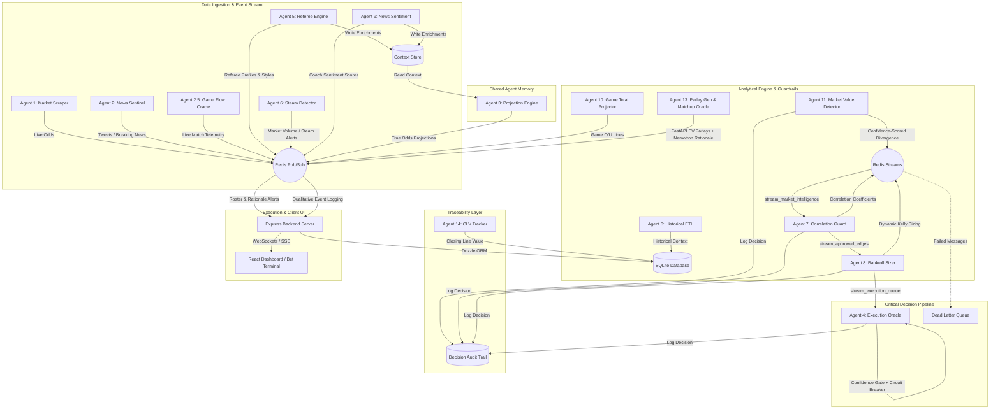

# CourtSideEdge: Real-Time WNBA Quantitative Analytics & Wager Terminal

CourtSideEdge is an agentic quantitative sports-betting system built for real-time edge detection, portfolio risk sizers, referee telemetry analysis, and high-EV parlay formulation. It orchestrates a **14-agent decoupled microservice architecture** communicating via Redis Pub/Sub and Redis Streams, backing up to SQLite, and exposing live data via WebSockets and SSE to a premium dashboard.

---

## 1. System Architecture



### The 14-Agent Roster

| # | Agent | Role | Channel/Stream | Protocol |
|---|-------|------|----------------|----------|
| 0 | **Historical ETL** | Syncs team stats, rosters, past outcomes to SQLite | Direct DB | Batch |
| 1 | **Market Scraper** | Monitors sportsbooks for live line openings & movements | `channel_live_odds` | Pub/Sub |
| 2 | **News Sentinel** | Listens to Twitter/X for breaking team updates | `channel_roster_updates` | Pub/Sub |
| 2.5 | **Game Flow Oracle** | Aggregates real-time play-by-play for mid-game shifts | `channel_live_flow` | Pub/Sub |
| 3 | **Projection Engine** | 6-layer ensemble (Bayesian + Poisson + Copula + XGBoost). **Reads shared context store** for referee/fatigue/roster enrichments | `channel_true_projections` | Pub/Sub |
| 4 | **Execution Oracle** | Enforces 15% max drawdown circuit breaker + **0.5 confidence gate** | `stream_execution_queue` | **Streams** |
| 5 | **Referee Engine** | Profiles officiating crews for pace/foul effects. **Writes to context store** | `channel_referee_context` | Pub/Sub + Context |
| 6 | **Steam Detector** | Spots syndicate action and sharp liquidity moves | `channel_steam_alerts` | Pub/Sub |
| 7 | **Correlation Guard** | Monitors same-game exposure with **dynamic limits** (3-4 based on confidence) | `stream_market_intelligence` → `stream_approved_edges` | **Streams** |
| 8 | **Bankroll Sizer** | **Dynamic Kelly** with adaptive fractions (HOT/NORMAL/COLD/HALT regimes) | `stream_approved_edges` → `stream_execution_queue` | **Streams** |
| 9 | **News Sentiment** | NLP sentiment on coach quotes and travel fatigue. **Writes to context store** | `channel_sentiment_context` | Pub/Sub + Context |
| 10 | **Game Total Projector** | Evaluates tempo/defense for full-game O/U bounds | `channel_game_totals` | Pub/Sub |
| 11 | **Market Value Detector** | Scans book pricing discrepancies with **confidence scoring** | `stream_market_intelligence` | **Streams** |
| 13 | **Parlay Gen & Matchup Oracle** | FastAPI service generating 2-leg EV parlays with qualitative summaries | `/api/parlay/generate` | REST |
| 14 | **CLV Tracker** | Measures Closing-Line Value — the gold standard for betting sharpness | `channel_live_odds` + `/api/clv/*` | Pub/Sub + REST |

---

## 2. Architecture Improvements (v5.0)

### Shared Agent Memory Layer
Agents no longer operate in isolation. A `agent_context_store` table and Redis hash (`agent:context:{game_id}`) act as a shared blackboard:
- **Agent 5** writes referee foul bias profiles
- **Agent 9** writes coach fatigue and sentiment scores
- **Agent 3** reads all enrichments before running its ensemble, adjusting usage redistribution and pace projections

### Confidence Scoring Protocol
Every signal on Redis now carries a standardized confidence envelope (`confidence`, `sample_size`, `decay_seconds`). This allows:
- Agent 7 to use dynamic correlation limits (allow 4 same-game bets if all signals are >0.85)
- Agent 8 to scale Kelly fraction by signal confidence
- Agent 4 to reject execution below a 0.5 confidence floor

### Decision Audit Trail
A `decision_audit` table logs every agent's approve/reject/size/execute decision with a shared `trace_id` UUID. Query any trace to see the full decision chain: Agent 11 → 7 → 8 → 4.

### Redis Streams & Dead-Letter Queue
The critical execution pipeline (`stream_market_intelligence` → `stream_approved_edges` → `stream_execution_queue`) uses Redis Streams with consumer groups instead of fire-and-forget Pub/Sub. Failed messages move to `*_dlq` streams for retry.

### Dynamic Kelly Recalibration
Agent 8 queries the last 50 settled bets from SQLite to compute realized win rate, then adapts:
- Win rate ≥ 60% → 1/3 Kelly (HOT_STREAK)
- Win rate ≥ 50% → 1/4 Kelly (NORMAL)
- Win rate ≥ 48% → 1/6 Kelly (COLD_STREAK)
- Win rate < 48% → **HALT all sizing**

### Closing-Line Value (CLV) Tracker
Agent 14 records the closing odds at game time and calculates CLV percentage for every bet. The `/api/clv/summary` endpoint provides aggregate CLV statistics broken down by stat category and result type.

---

## 3. Developer Setup & Environment Instructions

### Prerequisites
- **Node.js** (v18+)
- **Python** (v3.11+)
- **Docker** & **Docker Compose** (Required for containerized runtime)

### Local Development Flow

1. **Clone & Configure Environment**:
   Create a `.env` file at the root:
   ```env
   REDIS_URL=redis://localhost:6379
   PORT=3000
   ```

2. **Database Seeding**:
   The database schema is initialized and populated automatically when the backend server launches. To reset the DB manually:
   ```bash
   cd web/server
   npm run seed
   ```

3. **Launch the Redis Bus & Agents (Docker)**:
   ```bash
   docker-compose up --build -d
   ```
   *Note: If Docker is unavailable locally, the express backend handles connection failures gracefully and defaults to offline/SQLite-direct capabilities.*

4. **Run Server & Client locally**:
   - **Backend Server (Port 3000)**:
     ```bash
     cd web/server
     npm install
     npm run dev
     ```
   - **Frontend Dashboard (Port 5173)**:
     ```bash
     cd web/client
     npm install
     npm run dev
     ```

---

## 4. Telemetry Systems & Messaging Bus

### Pub/Sub Channel Registry (Informational)
- `channel_live_odds`: Raw sportsbook odds updates
- `channel_true_projections`: Player projections from Agent 3's ensemble
- `channel_ev_alerts` / `channel_steam_alerts`: Market edge notifications
- `channel_roster_updates` / `channel_referee_context` / `channel_sentiment_context`: Qualitative event streams, permanently logged to SQLite

### Redis Streams Registry (Critical Pipeline)
- `stream_market_intelligence`: Agent 11 → Agent 7 (with consumer groups & DLQ)
- `stream_approved_edges`: Agent 7 → Agent 8
- `stream_execution_queue`: Agent 8 → Agent 4

### Web Telemetry Bridging
- **WebSockets (`ws://localhost:3000`)**: Real-time channel for odds matrices and health telemetry
- **SSE (`/api/stream/alerts`)**: Continuous stream of EV alerts, roster shifts, and qualitative warnings

---

## 5. SQLite Data Schema

All persistent data lives in `hoopstats_wnba.db`:

```sql
-- Core Players Registry
CREATE TABLE players (id TEXT PRIMARY KEY, name TEXT NOT NULL, team TEXT NOT NULL, status TEXT);

-- Bankroll Tracking
CREATE TABLE bankroll_history (id INTEGER PRIMARY KEY AUTOINCREMENT, timestamp INTEGER NOT NULL, balance REAL NOT NULL, drawdown_pct REAL NOT NULL);

-- Wager Ledger (parlay containers + child legs + CLV tracking)
CREATE TABLE bets (
    id INTEGER PRIMARY KEY AUTOINCREMENT,
    parent_id INTEGER, is_parlay INTEGER,
    player TEXT, stat TEXT, line REAL, over_under TEXT,
    book_odds INTEGER NOT NULL, true_odds REAL, edge_pct REAL,
    stake REAL NOT NULL, result TEXT, actual_value REAL, profit_loss REAL,
    placed_at INTEGER NOT NULL, settled_at INTEGER,
    opposing_team TEXT, notes TEXT,
    closing_odds INTEGER, clv_pct REAL  -- Agent 14 CLV Tracker
);

-- Shared Agent Memory Layer
CREATE TABLE agent_context_store (
    id INTEGER PRIMARY KEY AUTOINCREMENT,
    game_id TEXT NOT NULL, agent_id TEXT NOT NULL,
    context_key TEXT NOT NULL, context_value TEXT NOT NULL,
    confidence REAL NOT NULL, ttl_seconds INTEGER DEFAULT 3600,
    created_at INTEGER NOT NULL,
    UNIQUE(game_id, agent_id, context_key)
);

-- Decision Audit Trail
CREATE TABLE decision_audit (
    id INTEGER PRIMARY KEY AUTOINCREMENT,
    trace_id TEXT NOT NULL, agent_id TEXT NOT NULL,
    action TEXT NOT NULL, reason TEXT,
    input_payload TEXT, output_payload TEXT,
    confidence REAL, timestamp INTEGER NOT NULL
);

-- Qualitative Event Logs
CREATE TABLE qualitative_events (id INTEGER PRIMARY KEY AUTOINCREMENT, channel TEXT NOT NULL, payload TEXT NOT NULL, timestamp INTEGER NOT NULL);
```

---

## 6. API Reference

### Context Store
| Method | Endpoint | Description |
|--------|----------|-------------|
| `GET` | `/api/context/:game_id` | All agent enrichments for a game |
| `GET` | `/api/context` | Latest 100 context entries |
| `POST` | `/api/context` | Write a new context entry |

### Decision Audit
| Method | Endpoint | Description |
|--------|----------|-------------|
| `GET` | `/api/audit/:trace_id` | Full decision chain for an edge |
| `GET` | `/api/audit` | Latest 100 audit entries |
| `POST` | `/api/audit` | Log a new decision |

### CLV Tracking
| Method | Endpoint | Description |
|--------|----------|-------------|
| `GET` | `/api/clv/summary` | Aggregate CLV by stat & result |
| `PATCH` | `/api/bets/:id/clv` | Record closing odds for a bet |

### Bet Terminal
| Method | Endpoint | Description |
|--------|----------|-------------|
| `GET` | `/api/bets` | All wagers |
| `POST` | `/api/bets` | Create bet (straight or parlay) |
| `PATCH` | `/api/bets/:id/settle` | Settle a bet |
| `POST` | `/api/bets/upload` | Mock OCR ticket upload |
| `POST` | `/api/parlay/generate` | Agent 13 parlay generation |
